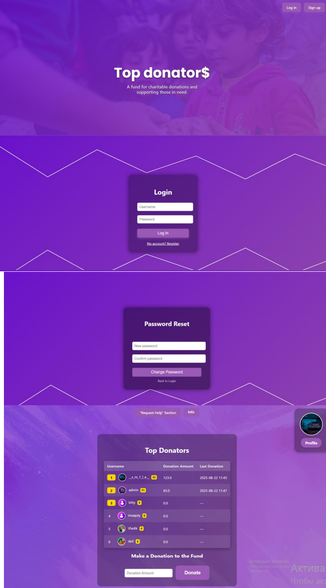

MyFastAPIApp_top_donators
Description

## Description
MyFastAPIApp is a FastAPI web application with support for user registration and authentication, the ability to make donations, send emails, manage profiles (change password, email, avatar), as well as protection via CSRF tokens and cookies. The application uses MySQL for data storage and supports logging of user actions.

**The website is available at:** https://top-donators.onrender.com

## Key Features
- User registration and login
- Change password and email
- Upload and change user avatar
- Support for multiple pages
- Donations
- Sending email notifications
- CSRF protection
- Working with cookies
- Logging user actions
- Connection to MySQL database

## Technologies Used
- Python 3.11+
- FastAPI
- SQLAlchemy
- MySQL
- Docker (optional for containerization)
- Ngrok (for local webhook)
- Uvicorn (ASGI server)

## Installation and Running

### 1. Clone the repository
```bash
git clone <repository_URL>
cd <project_folder>
2. Create a virtual environment (optional but recommended)
 python -m venv venv
 source venv/bin/activate   # Linux/macOS
 venv\Scripts\activate      # Windows
3-Install dependencies
 pip install -r requirements.txt


